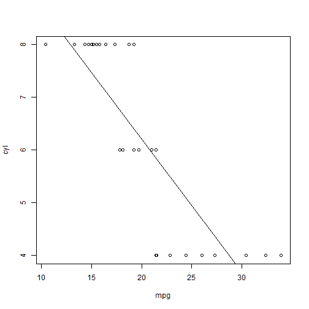

## Goal of this presentation

The presentation is intended to provide a very brief description of the project created for the Developing Data Projects course at Coursera (part of the Johns Hopkins Data Science series).  

---

## Application description

This application will read the data from the MTcars dataset (description on next slide) and graph the relationship between mgp (on the x-axis) and one of the other attributes in the MTcars dataset chosen by the user.  The user can also choose to plot the regression line calculated by the linear model (lm function) between the chosen attribute and mpg.

The application can be accessed at the following URL:
https://llangvin.shinyapps.io/DevelopingDataProducts/


---

## MTcars dataset

Extracted from the 1974 Motor Trend US magazine, and comprises fuel consumption and 10 aspects of automobile design and performance for 32 cars (1973-74 models) on 11 variables:


```r
  - Miles/(US) gallon
  - Number of cylinders
  - Displacement (cu.in.)
  - Gross horsepower
  - Rear axle ratio
  - Weight (lb/1000)
  - 1/4 mile time
  - V/S
  - Transmissions (0 = automatic, 1 = manual)
  - Number of forward gears
  - Number of carberators
```

Additional information on the MTcars dataset can be found at:
https://stat.ethz.ch/R-manual/R-devel/library/datasets/html/mtcars.html

---

## Code
Example code from the application showing how the plot is drawn and the line (if the user has selected the option to display the regression line):


```r
    plot(cyl ~ mpg, data=mtcars)
#      if user chooses to see the regression line dispaly it
        abline(lm(cyl ~ mpg, data=mtcars))
```

 
---


